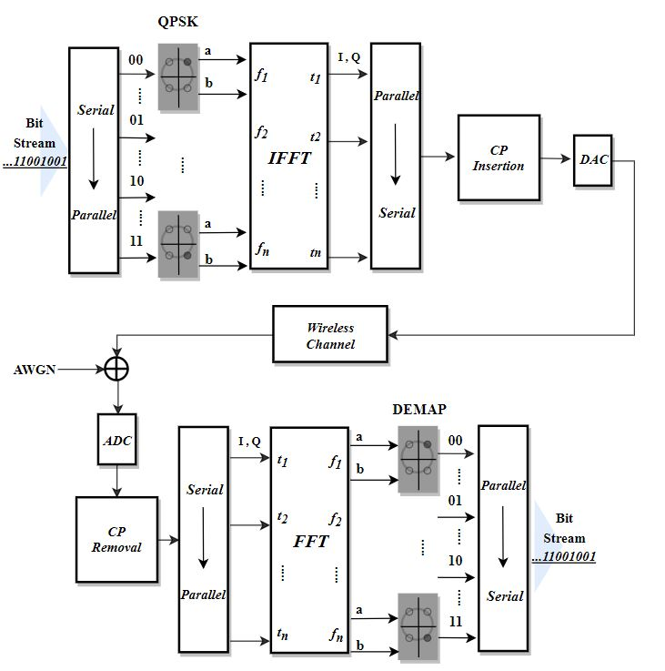
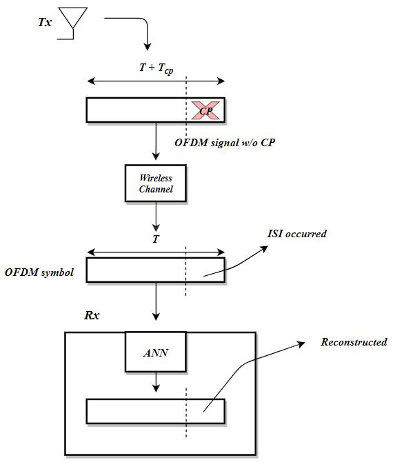
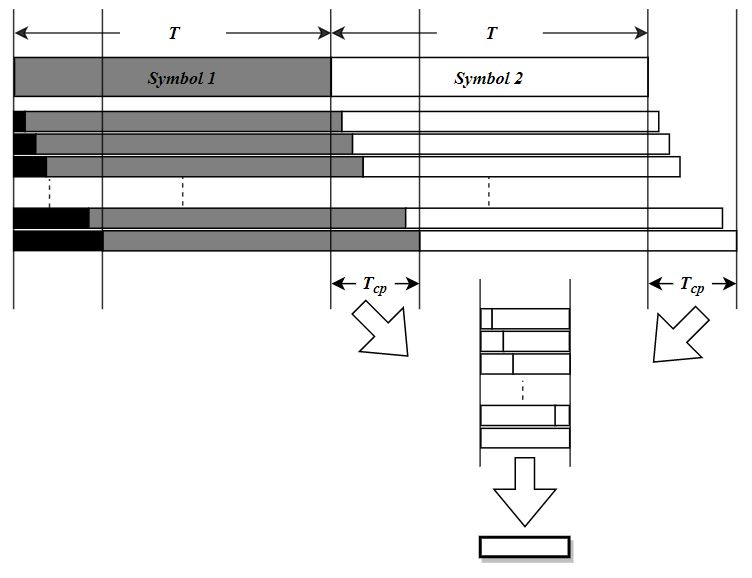

# OFDM 신호 검출을 위한 기계학습의 활용

#### (Application of Machine Learning for OFDM signal detection)

학사 학위 졸업 논문으로 진행하였던 프로젝트입니다.

 

> __Abstract__ 
>
> 유⋅무선 통신에서 직교 주파수 분할 다중 (OFDM) 시스템은 매우 광범 위하고 다양한 분야에 쓰이고 있다. OFDM의 CP (Cyclic Prefix)를 사용하 는 특성은 송⋅수신시에 생기는 ISI (Inter-Symbol Interference)에 의한 직 교성의 파괴를 효과적으로 극복할 수 있게 한다. 본 논문은 인공 신경망과 머신러닝의 활용을 통해 CP를 사용하지 않는 시스템을 설계한다. 신경망 모 델을 적용한 시스템과 기존 OFDM 시스템의 성능을 비교한 결과를 확인하 고 전송률의 저하 없이도 ISI를 극복할 수 있는 새로운 방법을 제안한다.

## 기존 OFDM 시스템 전송 흐름

## 기존 송신 과정의 ISI 발생과 CP의 활용 

 

## 본 논문에서 인공신경망을 활용한 송·수신 과정 구상도

## 제안하는 인공신경망의 입·출력 데이터 및 전체 모델 가시화

- 입력 ( ISI 미발생 구간)

- 출력 (채널 정보와 함께 학습 후 정상신호 예측)

- 전체 모델

## 인공신경망을 적용한 수신부 흐름

